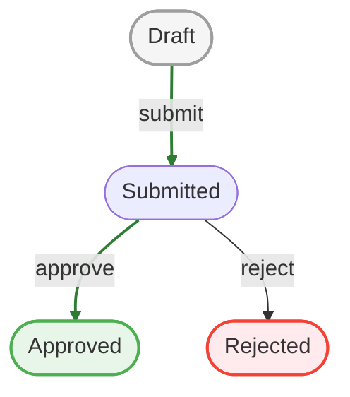

# Approval Flow

Approval flows are a good fit as long as only one current state is active at a time.

Example states:

- `draft`
- `submitted`
- `approved`
- `rejected`

## Diagram

A single reviewer moves a record `draft → submitted → approved`; `reject` is the alternative terminal outcome.

## When This Model Works Well

- one approver at a time
- serial review
- clear terminal outcomes

## When It Stops Fitting

If your process requires:

- multiple parallel approvals
- “finance and legal must both approve”
- partial approvals active at the same time

then you are moving beyond a single-state model.

That is the point where a true multi-place workflow engine becomes relevant.

