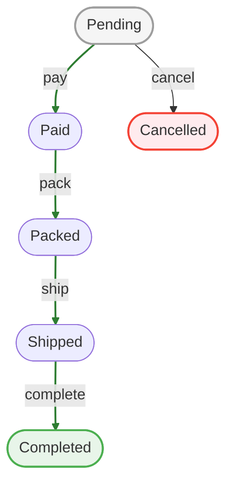

# Order Workflow

An order workflow is the canonical example for this plugin.

Typical states:

- `pending`
- `paid`
- `packed`
- `shipped`
- `completed`
- `cancelled`

Typical transitions:

- `pay`
- `pack`
- `ship`
- `complete`
- `cancel`

## Diagram

The happy path (green) runs `pay → pack → ship → complete`; `cancel` branches off to a failed state.



::: tip
This is exactly what `bin/cake workflow show order --mermaid` outputs, and what the [View Helper](/integration/view-helper)'s `diagram()` renders in your app — initial states are gray, final states green, failed states red, and happy-path transitions are highlighted. You never have to draw these by hand.
:::

## Good Practices

- keep transition names action-oriented
- use `reason` for cancellation or exceptional flows
- mark terminal failure states explicitly
- store operator identity in transition context

## Example

```php [src/Workflow/Order/State/PendingState.php]
#[Transition(to: PaidState::class, name: 'pay', happy: true)]
#[Transition(to: CancelledState::class, name: 'cancel')]
class PendingState extends BaseOrderState
{
    #[Guard('pay')]
    public function ensureHasPositiveTotal(): bool|string
    {
        return (float)$this->getEntity()?->get('total') > 0
            ? true
            : 'Order total must be positive';
    }
}
```

## Triggering UI Actions From Code

If the page shows actions such as `Deliver` or `Refund`, those button labels map to transition names you can call through the workflow API.
Instead of UI buttons, they can also be triggered programatically from anywhere within your code.
Often in the business logic, sometimes also in the communication layer.

Use `can()` to check first, then `apply()` to execute the transition and save the entity if it succeeds.

```php [src/Controller/OrdersController.php]
$order = $this->Orders->get(1);
$workflow = $this->workflowRegistry->get($order);

if ($workflow->can('deliver')) {
    $result = $workflow->apply('deliver', [
        'user_id' => $this->Authentication->getIdentity()->getIdentifier(),
        'reason' => 'Marked as delivered from controller action',
    ]);

    if ($result->isSuccess()) {
        $this->Orders->saveOrFail($order);
    }
}
```

```php [src/Controller/OrdersController.php]
$order = $this->Orders->get(1);
$workflow = $this->workflowRegistry->get($order);

if ($workflow->can('refund')) {
    $result = $workflow->apply('refund', [
        'user_id' => $this->Authentication->getIdentity()->getIdentifier(),
        'reason' => 'Refund approved by support',
    ]);

    if ($result->isSuccess()) {
        $this->Orders->saveOrFail($order);
    }
}
```

If you already fetched the available transitions for a view, the same names are the ones you pass in PHP:

```php [src/Controller/OrdersController.php]
$workflow = $this->workflowRegistry->get($order);
$transitions = $workflow->getAvailableTransitions();

if (in_array('deliver', $transitions, true)) {
    $workflow->apply('deliver');
}
```
