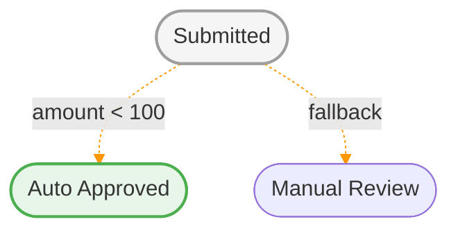

# Automatic Transitions

Automatic transitions let the engine branch without an explicit user-triggered event.

## What They Do

When the entity enters a state, the engine can immediately evaluate outgoing automatic transitions.

This is useful for:

- routing logic
- conditional branching
- auto-completion flows

In diagrams (and in the generated Mermaid output) automatic transitions are drawn as **dashed orange** arrows to set them apart from user-triggered ones. The first matching condition wins; an unconditioned transition acts as the fallback:



## Defining With Attributes

Mark a transition `automatic: true` and gate it with a `#[Condition]` method on the
state (mirroring `#[Guard]`). The method returns `bool`; the transition is taken only
when it returns `true`:

```php
use Workflow\Attribute\Condition;
use Workflow\Attribute\Transition;

#[Transition(to: ApprovedState::class, name: 'auto_approve', automatic: true)]
class ReviewState extends OrderState
{
    #[Condition('auto_approve')]
    public function isTrusted(): bool
    {
        return (bool)$this->getEntity()?->get('trusted');
    }
}
```

When the entity enters `review`, the engine evaluates `auto_approve` and advances to
`approved` if `isTrusted()` returns `true`. Leave the condition off for an
unconditional fallback branch. This matches the `automatic`/`condition` keys in the
NEON/YAML formats.

## How Selection Works

The engine evaluates automatic transitions in order:

- the first matching condition wins
- a transition without a condition acts as a fallback branch

To avoid loops, the engine enforces a maximum automatic transition count.

### Always Provide a Fallback on a Branch

When a state has **several** automatic transitions (a branch) that are all conditional and
none matches at runtime, the item has nowhere to go and silently stays put — easy to
introduce by forgetting the `else` branch. Guard against it:

- `bin/cake workflow validate` reports any automatic **branch** state (more than one
  automatic transition) that has no unconditional fallback. With `Workflow.strictMode` off
  this is a warning; with it on it is a hard error (non-zero exit).
- With `Workflow.strictMode` enabled, the engine **throws** at runtime instead of staying
  put when such a branch is reached and no condition matches — turning a silent stuck into
  a loud, debuggable failure.

The cleanest fix is simply to add an unconditional fallback transition (the `else`).

Two cases are exempt, because the item is not actually stuck:

- a **single** conditional automatic transition — a deliberate "advance when ready, otherwise
  wait" step, so it stays put when its condition is false (even in strict mode);
- a branch state that **also** has a non-automatic transition — a manual transition, or the
  transition a timeout fires — since a user or the timeout worker can still move the item.

Only a branch whose automatic transitions are its **sole** exit is reported or throws.

## Important Limitation

Automatic transitions are still part of a single-state model.

They do **not** mean:

- parallel active states
- fork/join workflow nets
- multiple simultaneous markings

So they help with branching, but they do not turn the engine into a multi-place workflow system.

