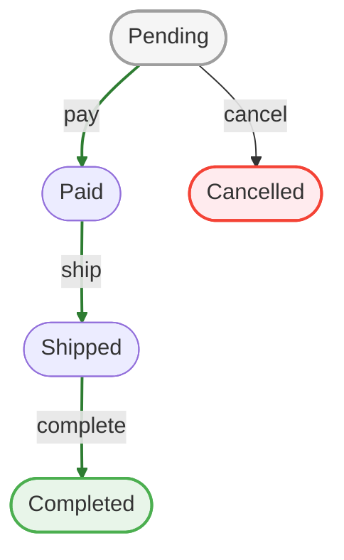
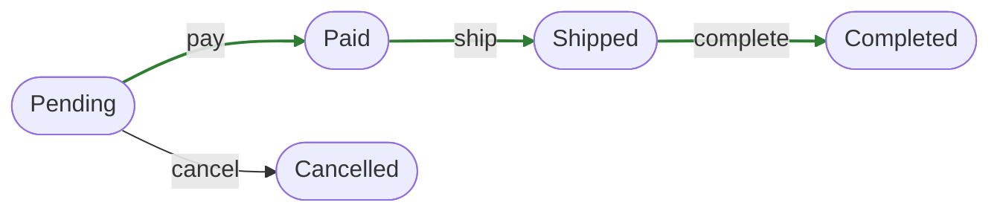

# Core Concepts

A workflow models the lifecycle of a record. This page explains the key concepts you need to understand.

## What Is a State Machine?

A state machine tracks where something is in its lifecycle:

- An order starts as `pending`, then becomes `paid`, then `shipped`, then `completed`
- A support ticket starts as `open`, then becomes `in_progress`, then `resolved` or `closed`

At any moment, the record is in exactly **one state**. Moving between states happens through **transitions**.

## States

A state represents a point in your entity's lifecycle.

```
[pending] → [paid] → [shipped] → [completed]
```

States have types:

| Type | Meaning |
|------|---------|
| **Initial** | Starting state for new entities (exactly one per workflow) |
| **Final** | Terminal state - entity lifecycle is done |
| **Failed** | Error state (implies final) |
| *Regular* | Any state that isn't initial, final, or failed |

Example with state types (initial state gray, final green, failed red):



## Transitions

A transition moves an entity from one state to another.

```php
$workflow = $this->workflowRegistry->get($order);
$workflow->apply('pay');
// order.state: pending → paid
```

Transitions have a **name** (like `pay`, `ship`, `cancel`) that you use in code.

### Happy Path

Mark primary transitions as "happy" to highlight the ideal flow:



The `pay → ship → complete` path is the happy path (highlighted green). The `cancel` transition is an alternative path.

## Guards

Guards control whether a transition is allowed.

```php
#[Guard('pay')]
public function ensurePayable(): bool|string
{
    if ($this->getEntity()->total <= 0) {
        return 'Order total must be positive';
    }
    return true;
}
```

A guard returns:
- `true` - transition is allowed
- `string` - transition is blocked with this reason

Multiple guards can protect the same transition. All must pass.

## Commands

Commands run when a transition succeeds.

```php
#[Command('pay')]
public function capturePayment(): void
{
    $this->getEntity()->set('payment_captured', true);
    $this->getEntity()->set('paid_at', new DateTime());
}
```

Use commands to:
- Update entity fields
- Trigger side effects (emails, webhooks)
- Set timestamps

## Lifecycle Callbacks

States can define callbacks for entering or leaving:

```php
#[OnEnter]
public function notifyCustomer(): void
{
    // Runs when entity enters this state
}

#[OnExit]
public function cleanupResources(): void
{
    // Runs when entity leaves this state
}
```

## Flags

Flags are metadata tags on states for querying:

```php
#[Flag('done')]
#[FinalState]
class CompletedState extends BaseOrderState
{
}
```

Query entities by flag:

```php
$completedOrders = $this->Orders->find('withFlag', flag: 'done')->toArray();
```

Common flags:
- `done` - work is complete
- `billable` - can be invoiced
- `requires_attention` - needs review

## Putting It Together

A minimal workflow has:

1. **States** - at least one initial and one final
2. **Transitions** - connections between states
3. **Guards** (optional) - protect transitions
4. **Commands** (optional) - side effects on transitions

### Using the Workflow Object (Recommended)

The `Workflow` class provides a clean, entity-centric API:

```php
// Get a workflow for an entity
$workflow = $this->workflowRegistry->get($order);

// Check and apply
if ($workflow->can('pay')) {
    $result = $workflow->apply('pay', ['user_id' => $userId]);
    if ($result->isSuccess()) {
        $this->Orders->save($order);
    }
}

// Query state
$workflow->getStateName();           // 'pending'
$workflow->isInState('pending');     // true
$workflow->isInFinalState();         // false
$workflow->getEnabledTransitions();  // ['pay', 'cancel']
```

### Using the Behavior

The behavior provides table-level methods via explicit access:

```php
$behavior = $this->Orders->getBehavior('Workflow');

if ($behavior->canTransition($order, 'pay')) {
    $result = $behavior->applyTransition($order, 'pay');
    if ($result->isSuccess()) {
        $this->Orders->save($order);
    }
}
```

Both approaches use the same underlying engine, guards, and commands.

## Next Steps

- [Quick Start](./quick-start) - Build your first workflow
- [Behavior Integration](./behavior) - Full API reference
- [Attributes](/definitions/attributes) - Define states with PHP attributes
