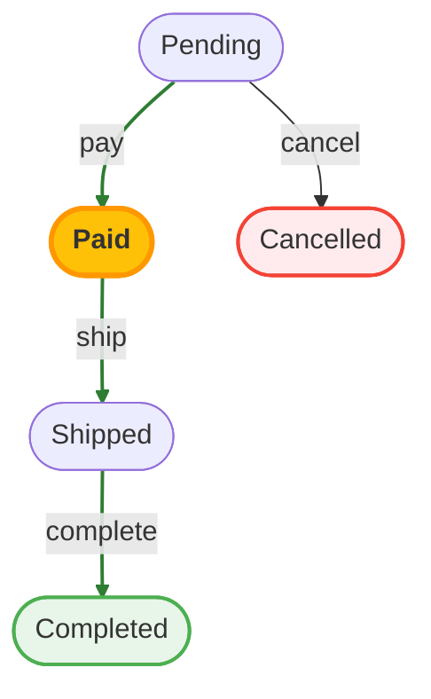

# View Helper

The `WorkflowHelper` provides template helpers for rendering workflow-related UI elements.

## Setup

Load the helper in your controller or `AppView`:

```php [src/View/AppView.php]
public function initialize(): void
{
    parent::initialize();
    $this->addHelper('Workflow.Workflow');
}
```

## Including Mermaid.js

To render workflow diagrams, include the Mermaid.js library:

```php
<?= $this->Workflow->includeMermaid() ?>
```

This outputs the CDN script tag and initializes Mermaid. Include it once in your layout or before any diagrams.

## Rendering Diagrams

Render a visual workflow diagram:

```php
<?= $this->Workflow->diagram($definition) ?>
```

For an order workflow this renders a diagram like the following, with the current state highlighted in amber when you pass the entity's state:



With options:

```php
<?= $this->Workflow->diagram($definition, [
    'id' => 'order-workflow-diagram',
    'class' => 'mermaid workflow-diagram',
]) ?>
```

To get raw Mermaid code (useful for custom rendering):

```php
$mermaidCode = $this->Workflow->getMermaidCode($definition);
```

## State Badge

Display the current state as a styled badge:

```php
<?= $this->Workflow->stateBadge($definition, $entity->state) ?>
```

The badge automatically uses the state's configured color and calculates a contrasting text color.

With custom class:

```php
<?= $this->Workflow->stateBadge($definition, $entity->state, [
    'class' => 'badge rounded-pill',
]) ?>
```

## Transition Buttons

Render buttons for available transitions:

```php
<?= $this->Workflow->transitionButtons($entity, $availableTransitions) ?>
```

With custom URL and styling:

```php
<?= $this->Workflow->transitionButtons($entity, $availableTransitions, [
    'url' => ['controller' => 'Orders', 'action' => 'transition'],
    'buttonClass' => 'btn btn-primary btn-sm',
]) ?>
```

Each button includes a `data-transition` attribute for JavaScript handling.

::: warning
`transitionButtons()` renders **GET links**. For state changes prefer `panel()` /
`postTransitionButtons()` below, which render CSRF-protected POST forms.
:::

## Workflow Panel (drop-in)

`panel()` renders the current-state badge plus a CSRF-protected POST button for each
available transition — the whole status widget in one call:

```php
<?= $this->Workflow->panel($definition, $order, $availableTransitions, [
    'url' => ['controller' => 'Orders', 'action' => 'transition'],
]) ?>
```

The entity id and transition name are appended to the URL automatically (e.g.
`/orders/transition/42/pay`), and each button POSTs `transition`, ready to be
handled by [`WorkflowComponent::handleTransition()`](/integration/component):

```php
// OrdersController::transition()
public function transition($id)
{
    $order = $this->Orders->get($id);

    return $this->Workflow->handleTransition($this->Orders, $order, ['action' => 'view', $id]);
}
```

Use `postTransitionButtons()` if you only want the buttons without the badge wrapper.

## Getting State Color

Get the color configured for a state:

```php
$color = $this->Workflow->getStateColor($definition, $entity->state);
```

Returns the hex color (e.g., `#00AA00`) or a default gray if none is configured.

## Complete Example

```php
<?php
// In your controller: pass definition and availableTransitions to view
// $workflow = $this->workflowRegistry->get($order);
// $this->set('definition', $workflow->getDefinition());
// $this->set('availableTransitions', $workflow->getAvailableTransitions());
?>

<?= $this->Workflow->includeMermaid() ?>

<div class="order-details">
    <h3>Order #<?= $order->id ?></h3>

    <p>
        Status: <?= $this->Workflow->stateBadge($definition, $order->state) ?>
    </p>

    <?php if ($availableTransitions) { ?>
        <div class="actions">
            <?= $this->Workflow->transitionButtons($order, $availableTransitions) ?>
        </div>
    <?php } ?>
</div>

<div class="workflow-visualization">
    <h4>Workflow</h4>
    <?= $this->Workflow->diagram($definition) ?>
</div>
```
