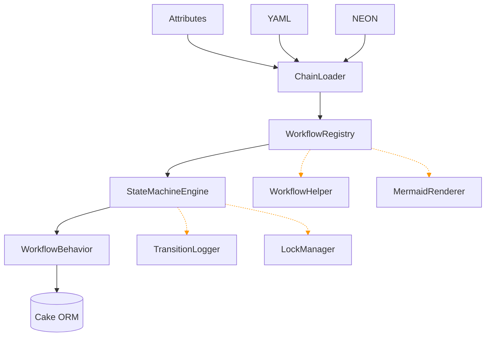

# Architecture

At runtime, the package is composed of a few clear layers. Definitions flow down through the loaders into the registry and engine; the operational and UI layers (dashed) read from the engine and registry without sitting in the apply path.

## Loaders

Loaders read definitions from:

- attributes
- YAML
- NEON

They are combined through `ChainLoader`.

## Registry

`WorkflowRegistry` is the central lookup layer between the app and engine.

It resolves:

- definitions
- workflow names
- engine instances

## Engine

`StateMachineEngine` applies transitions and handles:

- current-state resolution
- final-state blocking
- reasons
- guards
- commands
- `OnEnter` and `OnExit`
- automatic transitions

## Integration Layer

`WorkflowBehavior` adapts the engine for Cake ORM usage.

## Operational Services

- `TransitionLogger`
- `LockManager`
- timeout processing command

## UI Layer

- admin controllers and templates
- `WorkflowHelper`
- `MermaidRenderer`

