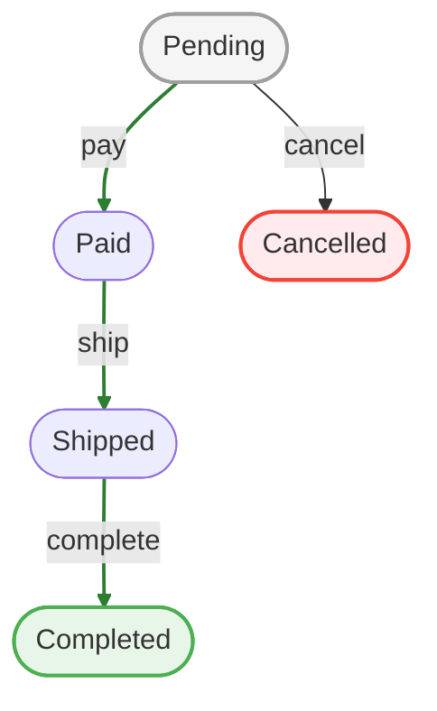

# CLI Reference

## Workflow Commands

### `workflow init`

Scaffold an attribute-based workflow skeleton.

```bash
bin/cake workflow init order Orders
```

### `workflow list`

List configured workflows.

```bash
bin/cake workflow list
bin/cake workflow list --verbose
```

### `workflow show`

Show one workflow in detail.

```bash
bin/cake workflow show order
bin/cake workflow show order --mermaid
```

The `--mermaid` option prints a [Mermaid](https://mermaid.js.org/) `flowchart` definition you can paste into Markdown, an issue, or this documentation. It renders like this:



### `workflow validate`

Validate one or more workflows and surface analyzer findings. With `--check-data`
it also reports records in obsolete states and, when versioning is enabled,
unversioned and stale records.

```bash
bin/cake workflow validate
bin/cake workflow validate order --check-data
```

### `workflow stamp`

Backfill the current definition version hash onto existing records. Run once when
enabling versioning on a table that already holds data. Stamps unversioned (NULL)
records by default; use `--all` to re-stamp every record.

```bash
bin/cake workflow stamp order
bin/cake workflow stamp order --all
bin/cake workflow stamp order --dry-run
```

### `workflow migrate`

Move records forward to the current definition: re-stamp stale records and map
orphaned records (whose state was removed/renamed) to a valid state. Refuses to
run if any orphaned state lacks a mapping. See
[Versioning & Drift Safety](../guide/versioning.md).

```bash
bin/cake workflow migrate order --map old_state:new_state,legacy:pending
bin/cake workflow migrate order --map legacy:pending --dry-run
```

### `workflow timeouts`

Process due timeouts.

```bash
bin/cake workflow timeouts
bin/cake workflow timeouts --dry-run
bin/cake workflow timeouts --limit 100
```

## Bake Commands

### `bake workflow_state`

Requires `cakephp/bake` and the `Bake` plugin.

```bash
bin/cake bake workflow_state Order/Shipped
bin/cake bake workflow_state Order/Shipped --final
bin/cake bake workflow_state Order/Shipped --transition-to Delivered --transition-name deliver
```

